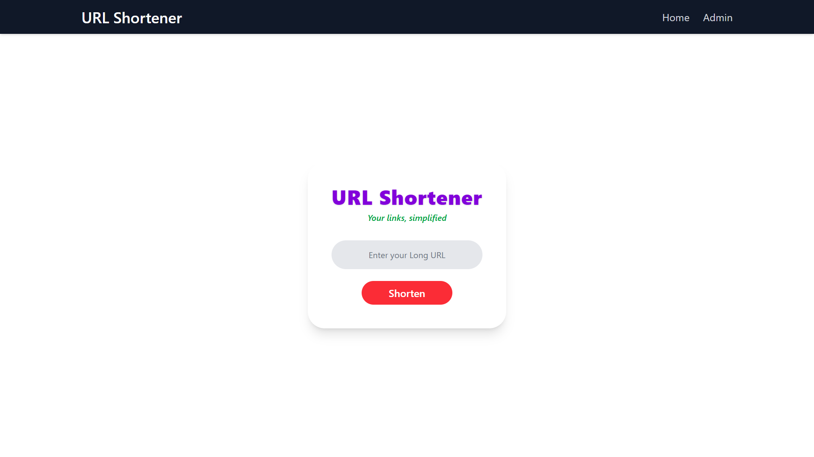
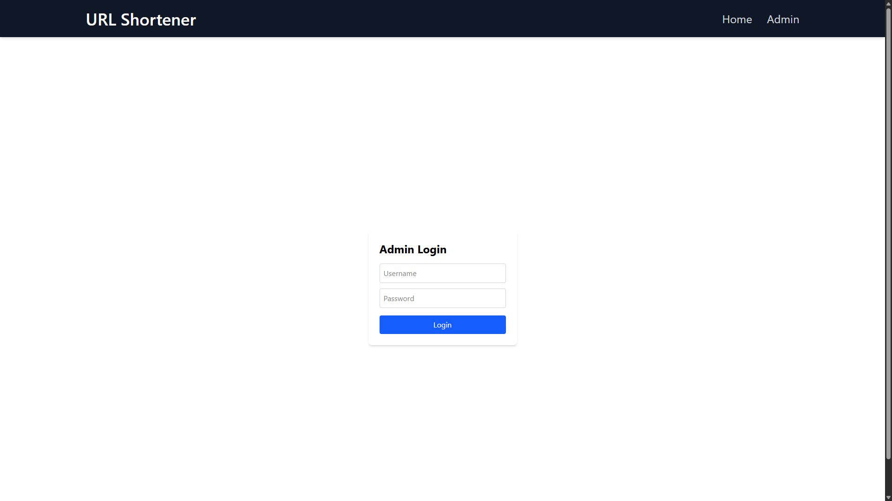
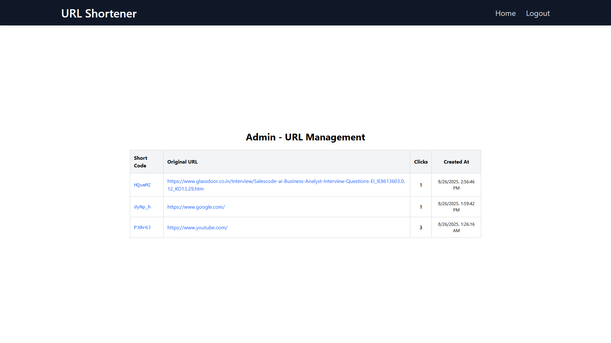

<p align="center">
  
</p>

<h1 align="center">🚀 URL Shortener App (MERN Stack)</h1>
<p align="center">Simplify Your Links 🔗</p>

<p align="center">
  <a href="https://url-shortner-web-app.netlify.app/">
    
  </a>
  
  
</p>

<p align="center">
  <a href="https://url-shortner-web-app.netlify.app/"><b>Visit Live Demo 🚀</b></a>
</p>

---

## 📑 Table of Contents

- [Project Description](#project-description)
- [Tech Stack](#️-tech-stack)
- [Features](#-features)
- [Getting Started](#-getting-started)
  - [Prerequisites](#prerequisites)
  - [Installation](#installation)
  - [Setup Environment Variables](#setup-environment-variables)
  - [Running in Development](#running-in-development)
- [Deployment](#-deployment)
- [Sneak Peek](#-sneak-peek)
- [Future Enhancements](#-future-enhancements)
- [Feedback](#-feedback)
- [Connect with Me](#-connect-with-me)

---

## 📖 Project Description

**URL Shortener App** is a full-stack web application built with the MERN stack (MongoDB, Express, React, Node.js). It allows users to easily shorten long URLs, making them easier to share and manage. The app features a simple user interface for generating short links, an admin dashboard for managing URLs and viewing statistics, and secure authentication for admin access. The project is designed to be fast, responsive, and easy to deploy.

---

## 🛠️ Tech Stack

<p>
  
  
  
  
  
  
</p>

- **Hosting:** Netlify (Frontend), Render (Backend)
- Secure environment configurations using `.env` variables

---


## ✨ Features

| Feature                       | Benefit                                                   |
|-------------------------------|-----------------------------------------------------------|
| 🔥 URL Shortening             | Fast generation of short, shareable URLs                  |
| 🎯 Simple User Interface      | Easy input of long URLs and instant short URL display     |
| 📊 Admin Dashboard            | View all shortened URLs with click stats and timestamps   |
| 🔐 Secure Admin Authentication| Protected admin routes with secure login and logout       |
| 📋 Copy to Clipboard          | One-click copy of shortened URLs                          |
| 🌎 Responsive Design          | Mobile and desktop friendly                               |

---

## 🚀 Getting Started

### Prerequisites

- [Node.js](https://nodejs.org/) and npm installed
- MongoDB instance (Atlas or local)

---

### Installation

```bash
git clone https://github.com/priyanshu-negi/URL-Shortner.git
cd URL-Shortner/backend
npm install
cd ../frontend
npm install
```

---

### Setup Environment Variables

Create `.env` files in `/backend` and `/frontend` with the following variables:

#### Backend `.env`

```
MONGO_URI=your_mongo_connection_string
ADMIN_USERNAME=your_admin_username
ADMIN_PASSWORD=your_admin_password
BASE_URL=http://localhost:5000
```

#### Frontend `.env`

```
VITE_BACKEND_URL=http://localhost:5000/api/shorten
VITE_ADMIN_API_URL=http://localhost:5000/api/admin/urls
```

---

### Running in Development

Start backend server:

```bash
cd backend
npm run dev
```

Start frontend server:

```bash
cd frontend
npm run dev
```

Open [http://localhost:3000](http://localhost:3000) to use the app.

---

## 🌐 Deployment

- **Backend:** [Render](https://url-shortner-backend-c46p.onrender.com)
- **Frontend:** [Netlify](https://url-shortner-web-app.netlify.app)

---

## 👀 Sneak Peek

<p align="center">
  
  <br/><br/>
  
  <br/><br/>
  
</p>

---

## 🔮 Future Enhancements

- 🔐 Add JWT token-based authentication
- 📈 Add analytics with charts and graphs
- 🌍 Support custom short domains
- 🚀 Add user registration and personalized URL management

---

## 💬 Feedback

I’d love to hear your thoughts and suggestions!  
Contact me at: [itspriyanshunegi@gmail.com](mailto:itspriyanshunegi@gmail.com)

---

## 📬 Connect with Me

[](https://www.linkedin.com/in/priyanshu-negi/)

---

<p align="center"><i>Thank you for checking out my URL Shortener project!</i></p>
